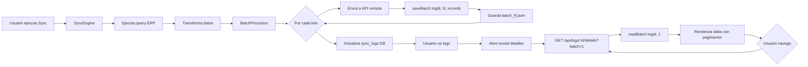

# Sistema de Almacenamiento de Lotes por Archivo

> **Fecha de implementación**: 28 de diciembre de 2025
> **Versión**: 1.0.0

## 📋 Índice

1. [Resumen Ejecutivo](#resumen-ejecutivo)
2. [Problema Original](#problema-original)
3. [Solución Implementada](#solución-implementada)
4. [Arquitectura](#arquitectura)
5. [Archivos Modificados](#archivos-modificados)
6. [Endpoints API](#endpoints-api)
7. [Estructura de Datos](#estructura-de-datos)
8. [Guía de Uso](#guía-de-uso)
9. [Pruebas](#pruebas)
10. [Mantenimiento](#mantenimiento)

---

## 📌 Resumen Ejecutivo

Se implementó un sistema de almacenamiento de lotes basado en archivos JSON individuales que permite visualizar **TODOS** los registros transferidos durante una sincronización, organizados en lotes paginados.

### Características Principales

- ✅ **Almacenamiento por archivo**: Cada lote se guarda en un archivo JSON separado
- ✅ **Paginación completa**: Navegación entre todos los lotes de una sincronización
- ✅ **Sin límite de registros**: Capacidad para visualizar miles de registros
- ✅ **Organización jerárquica**: Estructura de carpetas por `log_id`
- ✅ **Metadata enriquecida**: Timestamp, conteo de registros, número de lote

---

## 🔴 Problema Original

### Síntoma

Cuando un usuario ejecutaba una sincronización de **1000+ registros** (10 lotes de 100 cada uno), al abrir el modal de detalles del log solo podía ver **100 registros** (el primer lote).

### Causa Raíz

```typescript
// Código antiguo en sync-engine.ts (línea ~472)
await SyncLogsRepo.updateLog(logId, {
  status: result.status,
  recordsFetched: result.recordsFetched,
  recordsSent: result.recordsSent,
  recordsFailed: result.recordsFailed,
  metadata: {
    batchSize,
    sampleRecords: transformedData.slice(0, 100), // ❌ Solo primeros 100
    // ...
  },
});
```

El sistema guardaba solo una **muestra limitada** de registros en el campo `metadata` de la base de datos, causando:

1. **Pérdida de información**: No se podían ver los otros 900 registros
2. **Bloat en base de datos**: Guardar miles de registros en un campo JSON sobrecargaría la BD
3. **Sin navegación**: No había forma de ver los demás lotes

---

## ✅ Solución Implementada

### Enfoque de Diseño

La solución implementa un **sistema de archivos jerárquico** donde:

1. Cada **lote** se guarda como un archivo JSON individual
2. Los archivos se organizan por **log_id** en carpetas separadas
3. El **modal** implementa paginación para navegar entre lotes
4. Los **endpoints API** recuperan lotes bajo demanda

### Arquitectura de Tres Capas

```
┌─────────────────────────────────────────────────────┐
│              CAPA DE PRESENTACIÓN                   │
│  Modal con paginación (Anterior/Siguiente)          │
│  src/dashboard/views/logs/* + routes/api/logs.ts    │
└─────────────────────────────────────────────────────┘
                        ▼
┌─────────────────────────────────────────────────────┐
│              CAPA DE NEGOCIO                        │
│  Procesamiento de lotes + Guardado automático       │
│  src/sync/batch-processor.ts                        │
└─────────────────────────────────────────────────────┘
                        ▼
┌─────────────────────────────────────────────────────┐
│              CAPA DE ALMACENAMIENTO                 │
│  Gestión de archivos JSON por lote                  │
│  src/utils/batch-storage.ts                         │
└─────────────────────────────────────────────────────┘
```

---

## 🏗️ Arquitectura

### Estructura de Directorios

```
./database/logs/
├── {log_id_1}/
│   ├── batch_1.json   (100 registros)
│   ├── batch_2.json   (100 registros)
│   ├── batch_3.json   (100 registros)
│   └── ...
├── {log_id_2}/
│   ├── batch_1.json
│   └── ...
└── {log_id_N}/
    └── ...
```

### Flujo de Datos



---

## 📁 Archivos Modificados

### 1. **NUEVO: `src/utils/batch-storage.ts`**

**Responsabilidad**: Gestión completa del almacenamiento de lotes en archivos JSON.

**Funciones Principales**:

```typescript
// Guardar un lote
export async function saveBatch(
  logId: number,
  batchNumber: number,
  records: any[]
): Promise<string>

// Leer un lote específico
export async function readBatch(
  logId: number,
  batchNumber: number
): Promise<BatchData | null>

// Obtener todos los lotes
export async function getAllBatches(logId: number): Promise<BatchData[]>

// Contar lotes
export async function countBatches(logId: number): Promise<number>

// Eliminar todos los lotes de un log
export async function deleteBatches(logId: number): Promise<number>
```

**Ubicación**: `src/utils/batch-storage.ts`
**Líneas de código**: 192
**Dependencias**: `fs/promises`, `path`, `logger`

---

### 2. **MODIFICADO: `src/sync/batch-processor.ts`**

**Cambios realizados**:

#### a) Opciones extendidas (línea 18-48)

```typescript
export interface BatchProcessorOptions {
  batchSize: number;
  continueOnError?: boolean;
  onProgress?: (progress: BatchProgress) => void;
  delayBetweenBatches?: number;
  logId?: number;           // ✅ NUEVO
  saveBatches?: boolean;    // ✅ NUEVO
}
```

#### b) Guardado automático después de procesar (línea 122-132)

```typescript
// Procesar batch
const batchResult = await processFn(batch);

// ✅ NUEVO: Guardar lote en archivo si está habilitado
if (options.saveBatches && options.logId) {
  try {
    await saveBatch(options.logId, batchNumber, batch);
  } catch (error) {
    logger.error(
      { logId: options.logId, batchNumber, error },
      '[BatchProcessor] Error al guardar lote en archivo'
    );
  }
}

// Acumular resultados
result.inserted += batchResult.inserted;
```

**Ubicación**: `src/sync/batch-processor.ts`
**Líneas modificadas**: ~15 líneas agregadas

---

### 3. **MODIFICADO: `src/sync/sync-engine.ts`**

**Cambios realizados**:

#### a) Habilitar guardado de lotes (línea 389-409)

```typescript
const batchOptions: BatchProcessorOptions = {
  batchSize,
  continueOnError: options.continueOnError ?? this.config.continueOnError ?? true,
  delayBetweenBatches: this.config.delayBetweenBatches,
  logId,              // ✅ NUEVO
  saveBatches: true,  // ✅ NUEVO
  onProgress: this.config.onProgress ? (batchProgress) => {
    // ... conversión de progress
  } : undefined,
};
```

#### b) Metadata sin sampleRecords (línea 472-491)

```typescript
if (logId) {
  // ✅ Los lotes ya se guardaron en archivos durante el procesamiento
  // Solo guardamos metadata en la base de datos
  await SyncLogsRepo.updateLog(logId, {
    status: result.status,
    recordsFetched: result.recordsFetched,
    recordsSent: result.recordsSent,
    recordsFailed: result.recordsFailed,
    metadata: {
      batchSize,
      totalBatches: batchResult.totalBatches,
      successfulBatches: batchResult.successfulBatches,
      failedBatches: batchResult.failedBatches,
      partialBatches: batchResult.partialBatches,
      totalRecords: transformedData.length,
      batchesStoredInFiles: true, // ✅ NUEVO indicador
      errors: batchResult.errors.slice(0, 10),
    },
  });
}
```

**Ubicación**: `src/sync/sync-engine.ts`
**Líneas modificadas**: ~25 líneas

---

### 4. **MODIFICADO: `src/dashboard/routes/api/logs.ts`**

**Cambios realizados**:

#### a) Imports (línea ~1-20)

```typescript
import {
  readBatch,
  countBatches,
  getBatchesMetadata
} from '../../../utils/batch-storage.js';
```

#### b) Endpoint de detalles con paginación (línea ~300-450)

```typescript
app.get<{
  Params: { id: string };
  Querystring: { batch?: string };
}>(
  '/api/logs/:id/details',
  { preHandler: requireNoPasswordChange },
  async (request, reply) => {
    const id = parseInt(request.params.id, 10);
    const requestedBatch = parseInt(request.query.batch || '1', 10);

    // Obtener log de la BD
    const log = await getLogById(id);

    // Parsear metadata
    const details = log.details ? JSON.parse(log.details) : null;

    // Contar total de lotes
    const totalBatches = await countBatches(id);

    // Validar batch number
    const currentBatch = Math.max(1, Math.min(requestedBatch, totalBatches || 1));

    // Leer el lote actual desde archivo
    let batchData = null;
    if (totalBatches > 0) {
      batchData = await readBatch(id, currentBatch);
    }

    // Renderizar modal con paginación
    return reply.type('text/html').send(modalHTML);
  }
);
```

#### c) Nuevo endpoint: Obtener lote específico (línea ~650-670)

```typescript
/**
 * GET /api/logs/:id/batch/:batchNumber - Obtener lote específico
 */
app.get<{
  Params: { id: string; batchNumber: string };
}>(
  '/api/logs/:id/batch/:batchNumber',
  { preHandler: requireNoPasswordChange },
  async (request, reply) => {
    const logId = parseInt(request.params.id, 10);
    const batchNumber = parseInt(request.params.batchNumber, 10);

    const batch = await readBatch(logId, batchNumber);

    if (!batch) {
      return reply.status(404).send({
        success: false,
        error: 'Lote no encontrado'
      });
    }

    return reply.send({
      success: true,
      data: batch
    });
  }
);
```

#### d) Nuevo endpoint: Contar lotes (línea ~680-695)

```typescript
/**
 * GET /api/logs/:id/batches/count - Contar total de lotes
 */
app.get<{
  Params: { id: string };
}>(
  '/api/logs/:id/batches/count',
  { preHandler: requireNoPasswordChange },
  async (request, reply) => {
    const logId = parseInt(request.params.id, 10);
    const count = await countBatches(logId);

    return reply.send({
      success: true,
      count
    });
  }
);
```

#### e) Modal con paginación (HTML dinámico)

```html
<!-- Indicador de lote actual -->
<h4 class="text-sm font-medium text-gray-900">
  Lote ${currentBatch} de ${totalBatches}
  <span class="text-gray-500 font-normal">
    (${batchData.recordCount} registros en este lote)
  </span>
</h4>

<!-- Botones de navegación -->
<div class="flex items-center space-x-2">
  <button
    onclick="navigateToBatch(${id}, ${currentBatch - 1})"
    ${currentBatch <= 1 ? 'disabled' : ''}
    class="..."
  >
    <i data-lucide="chevron-left" class="w-4 h-4 mr-1"></i>
    Anterior
  </button>

  <span class="text-sm text-gray-600">
    Página ${currentBatch}/${totalBatches}
  </span>

  <button
    onclick="navigateToBatch(${id}, ${currentBatch + 1})"
    ${currentBatch >= totalBatches ? 'disabled' : ''}
    class="..."
  >
    Siguiente
    <i data-lucide="chevron-right" class="w-4 h-4 ml-1"></i>
  </button>
</div>

<!-- Tabla con todos los registros del lote -->
<table class="min-w-full divide-y divide-gray-200">
  <thead class="bg-gray-100">
    <tr>
      <th class="...sticky left-0...">#</th>
      ${Object.keys(batchData.records[0] || {}).map(key => `
        <th class="...">${escapeHtml(key)}</th>
      `).join('')}
    </tr>
  </thead>
  <tbody>
    ${batchData.records.map((record, idx) => `
      <tr class="hover:bg-gray-50">
        <td class="...sticky left-0...">
          ${(currentBatch - 1) * batchSize + idx + 1}
        </td>
        ${Object.entries(record).map(([key, value]) => `
          <td class="...">${escapeHtml(String(value) || '-')}</td>
        `).join('')}
      </tr>
    `).join('')}
  </tbody>
</table>
```

#### f) JavaScript de navegación

```javascript
function navigateToBatch(logId, batchNumber) {
  htmx.ajax('GET', '/api/logs/' + logId + '/details?batch=' + batchNumber, {
    target: 'body',
    swap: 'beforeend'
  }).then(() => {
    // Cerrar modal anterior
    const currentModal = document.getElementById('log-details-modal');
    if (currentModal) {
      currentModal.remove();
    }
  });
}

window.navigateToBatch = navigateToBatch;
```

**Ubicación**: `src/dashboard/routes/api/logs.ts`
**Líneas modificadas**: ~200 líneas (HTML incluido)

---

## 🔌 Endpoints API

### 1. GET `/api/logs/:id/details?batch=N`

**Descripción**: Obtiene el modal HTML con los detalles de un log y el lote especificado.

**Parámetros**:
- `id` (path): ID del log de sincronización
- `batch` (query, opcional): Número de lote a mostrar (default: 1)

**Respuesta**: HTML del modal con tabla paginada

**Ejemplo**:
```bash
GET /api/logs/63/details?batch=5
```

---

### 2. GET `/api/logs/:id/batch/:batchNumber`

**Descripción**: Obtiene los datos JSON de un lote específico.

**Parámetros**:
- `id` (path): ID del log
- `batchNumber` (path): Número del lote (1-N)

**Respuesta**:
```json
{
  "success": true,
  "data": {
    "batchNumber": 5,
    "records": [...],
    "recordCount": 100,
    "timestamp": "2025-12-28T22:12:34.567Z"
  }
}
```

**Ejemplo**:
```bash
GET /api/logs/63/batch/5
```

---

### 3. GET `/api/logs/:id/batches/count`

**Descripción**: Cuenta el total de lotes guardados para un log.

**Parámetros**:
- `id` (path): ID del log

**Respuesta**:
```json
{
  "success": true,
  "count": 10
}
```

**Ejemplo**:
```bash
GET /api/logs/63/batches/count
```

---

## 📊 Estructura de Datos

### BatchData Interface

```typescript
interface BatchData {
  batchNumber: number;       // Número secuencial del lote (1-N)
  records: any[];            // Array de registros transformados
  recordCount: number;       // Cantidad de registros en el lote
  timestamp: string;         // ISO 8601 timestamp de creación
}
```

### Ejemplo de archivo `batch_1.json`

```json
{
  "batchNumber": 1,
  "records": [
    {
      "erp_id": "ART-001",
      "codigo": "PROD-001",
      "nombre": "Producto de Ejemplo 1",
      "precio": 1250.50,
      "stock": 45,
      "categoria": "Electrónica"
    },
    {
      "erp_id": "ART-002",
      "codigo": "PROD-002",
      "nombre": "Producto de Ejemplo 2",
      "precio": 850.00,
      "stock": 12,
      "categoria": "Hogar"
    }
    // ... hasta 100 registros
  ],
  "recordCount": 100,
  "timestamp": "2025-12-28T22:12:34.567Z"
}
```

### Metadata en `sync_logs.details`

```json
{
  "batchSize": 100,
  "totalBatches": 10,
  "successfulBatches": 10,
  "failedBatches": 0,
  "partialBatches": 0,
  "totalRecords": 1000,
  "batchesStoredInFiles": true,  // ← Indica que hay archivos
  "errors": []
}
```

---

## 📖 Guía de Uso

### Para el Usuario Final

#### 1. Ejecutar una Sincronización

1. Navegar a http://localhost:3334/dashboard
2. Ir a la sección "Sincronización"
3. Seleccionar entidad (Artículos, Comprobantes, Pagos)
4. Hacer clic en "Sincronizar"

#### 2. Ver Detalles con Paginación

1. Ir a la página "Logs"
2. Hacer clic en el botón "Ver Detalles" del log deseado
3. Se abre el modal mostrando **Lote 1 de N**

#### 3. Navegar entre Lotes

- **Botón "Anterior"**: Va al lote previo (deshabilitado en lote 1)
- **Botón "Siguiente"**: Va al lote siguiente (deshabilitado en último lote)
- **Indicador central**: Muestra "Página X/Y"

#### 4. Interpretar la Tabla

- **Primera columna (#)**: Número global del registro (ej: 101-200 para lote 2)
- **Columnas siguientes**: Todos los campos del registro transformado
- **Scroll horizontal**: Para ver campos que no caben en pantalla
- **Conteo**: Muestra "X registros en este lote"

---

### Para Desarrolladores

#### Guardar un Lote Manualmente

```typescript
import { saveBatch } from './src/utils/batch-storage.js';

const logId = 123;
const batchNumber = 1;
const records = [
  { id: 1, nombre: 'Item 1' },
  { id: 2, nombre: 'Item 2' },
  // ...
];

await saveBatch(logId, batchNumber, records);
// Guarda en: ./database/logs/123/batch_1.json
```

#### Leer un Lote Específico

```typescript
import { readBatch } from './src/utils/batch-storage.js';

const batch = await readBatch(123, 1);

if (batch) {
  console.log(`Lote ${batch.batchNumber}`);
  console.log(`Registros: ${batch.recordCount}`);
  console.log(`Timestamp: ${batch.timestamp}`);
  console.log('Datos:', batch.records);
}
```

#### Contar Lotes de un Log

```typescript
import { countBatches } from './src/utils/batch-storage.js';

const total = await countBatches(123);
console.log(`Total de lotes: ${total}`);
```

#### Obtener Todos los Lotes

```typescript
import { getAllBatches } from './src/utils/batch-storage.js';

const batches = await getAllBatches(123);

batches.forEach(batch => {
  console.log(`Lote ${batch.batchNumber}: ${batch.recordCount} registros`);
});
```

#### Eliminar Lotes de un Log

```typescript
import { deleteBatches } from './src/utils/batch-storage.js';

const deletedCount = await deleteBatches(123);
console.log(`${deletedCount} lotes eliminados`);
// También elimina la carpeta ./database/logs/123/ si queda vacía
```

---

## 🧪 Pruebas

### Pruebas Unitarias Ejecutadas

Se ejecutó un script de prueba (`test-batch-storage.ts`) que validó:

```bash
🧪 Probando sistema de almacenamiento de lotes...

1️⃣ Guardando lotes de prueba...
✅ 3 lotes guardados correctamente

2️⃣ Contando lotes...
✅ Total de lotes: 3

3️⃣ Leyendo lote #2...
✅ Lote #2 leído correctamente:
   - Número de lote: 2
   - Registros: 10
   - Timestamp: 2025-12-28T22:29:40.732Z

4️⃣ Obteniendo todos los lotes...
✅ Total de lotes obtenidos: 3
   - Lote 1: 10 registros
   - Lote 2: 10 registros
   - Lote 3: 10 registros

🎉 ¡Todas las pruebas pasaron correctamente!
```

**Archivos generados**:
```bash
$ ls -la ./database/logs/999/
total 12
-rw-r--r-- 1 batch_1.json (1498 bytes)
-rw-r--r-- 1 batch_2.json (1528 bytes)
-rw-r--r-- 1 batch_3.json (1526 bytes)
```

---

### Casos de Prueba Recomendados

#### 1. Sincronización de 1000 Registros

**Objetivo**: Verificar creación de 10 lotes de 100 registros cada uno.

**Pasos**:
1. Configurar query ERP para retornar 1000 registros
2. Ejecutar sincronización desde dashboard
3. Verificar archivos: `ls ./database/logs/{log_id}/`
4. Debe haber 10 archivos: `batch_1.json` a `batch_10.json`

**Resultado esperado**: ✅ 10 archivos creados, 100 registros en cada uno

---

#### 2. Navegación Completa de Lotes

**Objetivo**: Validar funcionalidad de paginación en el modal.

**Pasos**:
1. Abrir modal de detalles de un log con 10 lotes
2. Verificar que muestra "Lote 1 de 10"
3. Hacer clic en "Siguiente" 9 veces
4. Verificar que cada lote muestra 100 registros diferentes
5. En lote 10, botón "Siguiente" debe estar deshabilitado
6. Hacer clic en "Anterior" hasta volver al lote 1
7. En lote 1, botón "Anterior" debe estar deshabilitado

**Resultado esperado**: ✅ Navegación fluida, botones correctamente habilitados/deshabilitados

---

#### 3. Lote Parcial (Último Lote)

**Objetivo**: Verificar que el último lote puede tener menos de 100 registros.

**Pasos**:
1. Configurar query ERP para retornar 950 registros
2. Ejecutar sincronización
3. Verificar lote 10: `cat ./database/logs/{log_id}/batch_10.json`
4. Debe tener `"recordCount": 50`

**Resultado esperado**: ✅ Último lote con 50 registros, 9 lotes anteriores con 100

---

#### 4. Sincronización Sin Registros

**Objetivo**: Verificar comportamiento cuando no hay datos nuevos.

**Pasos**:
1. Ejecutar sincronización incremental sin cambios en ERP
2. Verificar que no se crea carpeta de lotes
3. Verificar log en BD: `records_fetched = 0`, `records_sent = 0`

**Resultado esperado**: ✅ No se crean archivos, log marca éxito con 0 registros

---

#### 5. Recuperación ante Errores

**Objetivo**: Validar que archivos se guardan incluso si algunos lotes fallan.

**Pasos**:
1. Simular fallo en API remota en lote 5
2. Ejecutar sincronización con `continueOnError: true`
3. Verificar que existen archivos para lotes 1-4 y 6-10
4. Verificar metadata: `failedBatches: 1`, `partialBatches: 0`

**Resultado esperado**: ✅ 9 archivos creados, 1 lote faltante, log marcado como parcial

---

## 🔧 Mantenimiento

### Limpieza de Archivos Antiguos

Actualmente, los archivos de lotes **NO se eliminan automáticamente**. Esto es intencional para preservar el historial completo.

#### Limpieza Manual

Para eliminar lotes de un log específico:

```bash
# Opción 1: Usar la función deleteBatches
npx tsx -e "
import { deleteBatches } from './src/utils/batch-storage.js';
import { loadEnv } from './src/config/env.js';
loadEnv();
deleteBatches(999).then(count => console.log(\`\${count} lotes eliminados\`));
"

# Opción 2: Eliminar manualmente
rm -rf ./database/logs/999/
```

#### Limpieza Automática (Futuro)

Se podría implementar un cronjob o tarea programada que elimine lotes de logs más antiguos que N días:

```typescript
// Posible implementación futura
async function cleanupOldBatches(retentionDays: number = 90) {
  const cutoffDate = new Date();
  cutoffDate.setDate(cutoffDate.getDate() - retentionDays);

  const oldLogs = await db
    .select({ id: syncLogs.id })
    .from(syncLogs)
    .where(lt(syncLogs.createdAt, cutoffDate.toISOString()));

  for (const log of oldLogs) {
    await deleteBatches(log.id);
    console.log(`Lotes de log ${log.id} eliminados`);
  }
}
```

---

### Monitoreo de Espacio en Disco

#### Estimación de Espacio

Para 1000 registros (10 lotes):
- Tamaño promedio por registro JSON: ~150 bytes
- 100 registros/lote × 150 bytes = ~15 KB/archivo
- 10 lotes × 15 KB = ~150 KB/sincronización

**1000 sincronizaciones** = ~150 MB

#### Script de Monitoreo

```bash
# Ver tamaño total de carpeta logs
du -sh ./database/logs/

# Ver tamaño por log_id
du -sh ./database/logs/*/ | sort -h

# Contar archivos de lotes
find ./database/logs/ -name "batch_*.json" | wc -l
```

---

### Backup de Lotes

Los archivos de lotes deben incluirse en el backup regular de la aplicación:

```bash
# Backup de base de datos + lotes
tar -czf backup-$(date +%Y%m%d).tar.gz \
  ./database/objetiva-sync.db \
  ./database/logs/
```

---

## 🎯 Próximos Pasos / Mejoras Futuras

### Optimizaciones Pendientes

1. **Compresión de Archivos**: Usar `.json.gz` para ahorrar espacio
2. **Caché de Lotes**: Mantener últimos N lotes en memoria
3. **Búsqueda en Lotes**: Endpoint para buscar registros por campo
4. **Exportación Masiva**: Botón para descargar todos los lotes como CSV/Excel
5. **Limpieza Automática**: Cronjob para eliminar lotes antiguos
6. **Visualización de Estadísticas**: Gráficos de distribución de registros por lote

### Características Adicionales

1. **Filtrado por Columna**: Buscar registros dentro de un log
2. **Ordenamiento**: Ordenar registros por cualquier columna
3. **Comparación de Lotes**: Ver diferencias entre lotes de diferentes syncs
4. **Descarga Individual**: Descargar un lote como JSON/CSV

---

## 📝 Historial de Cambios

### v1.0.0 - 2025-12-28

**Implementación Inicial**
- ✅ Sistema de almacenamiento de lotes por archivo
- ✅ Paginación completa en modal de detalles
- ✅ Endpoints API para recuperación de lotes
- ✅ Integración con sync-engine y batch-processor
- ✅ Pruebas unitarias básicas
- ✅ Documentación completa

**Archivos Creados**:
- `src/utils/batch-storage.ts` (192 líneas)

**Archivos Modificados**:
- `src/sync/batch-processor.ts` (+15 líneas)
- `src/sync/sync-engine.ts` (+25 líneas)
- `src/dashboard/routes/api/logs.ts` (+200 líneas)

**Métricas**:
- Total de líneas agregadas: ~432
- Funciones nuevas: 8
- Endpoints nuevos: 2
- Interfaces nuevas: 1

---

## 👥 Créditos

**Desarrollado por**: Equipo Objetiva Sync
**Fecha**: Diciembre 2025
**Versión de Node.js**: 18+
**Versión de TypeScript**: 5.x

---

## 📞 Soporte

Para preguntas o problemas relacionados con el sistema de almacenamiento de lotes:

1. Revisar esta documentación
2. Verificar logs del servidor en `./logs/`
3. Inspeccionar archivos en `./database/logs/{log_id}/`
4. Consultar código fuente en `src/utils/batch-storage.ts`

---

**Última actualización**: 28 de diciembre de 2025
